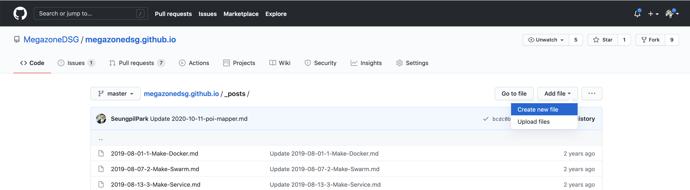
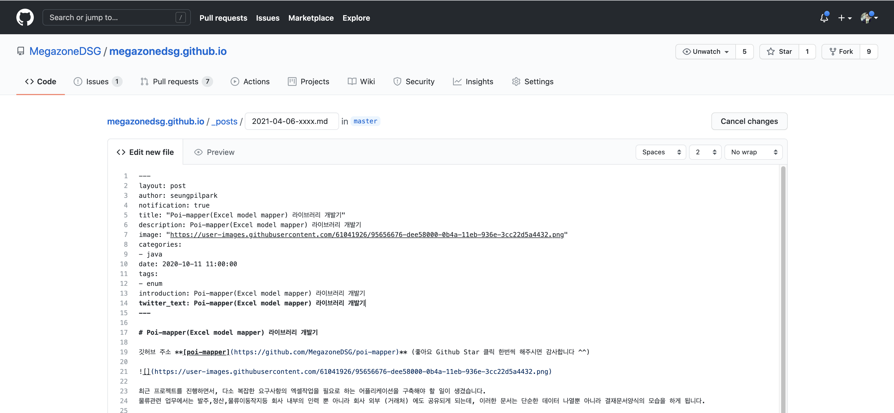

# 메가존 DSG 웹서비스 기술블로그 글쓰기

1. Github 에 가입하고, Github 아이디를 박승필(seungpilpark@mz.co.kr) 님에게 알려주시면 Github 블로그 프로젝트에 초대해드립니다.
2. 초대를 수락하신 후, 글을 작성합니다.

## 글 작성법

1. _posts 폴더 > Create New File 을 클릭합니다.



2. 아래의 형식대로 마크다운 형식으로 글을 작성한 후, 하단의 Commit New file 을 클릭합니다. 잠시 후 블로그에 새 글이 올라온 걸 확인 가능합니다.



- 글 작성 양식 설명입니다.
- 글 작성시 [https://dillinger.io/](https://dillinger.io/) 등의 온라인 마크다운에디터를 사용하시면 편리합니다.

```markdown
---
layout: post
author: seungpilpark   ->  가입하신 Github Username
notification: true     ->  새글작성 알림메일 여부
title: "Poi-mapper(Excel model mapper) 라이브러리 개발기"   ->  블로그 글 제목
description: Poi-mapper(Excel model mapper) 라이브러리 개발기  ->  블로그 글 설명
image: "https://user-images.githubusercontent.com/61041926/95656676-dee58000-0b4a-11eb-936e-3cc22d5a4432.png"  -> 블로그 글 이미지
categories:   ->  블로그 카테고리
- java
date: 2020-10-11 11:00:00  ->  블로그의 글 작성일 (이 날짜 순서대로 블로그 글이 정렬됩니다.)
tags:  ->  블로그 태그리스트
- enum
introduction: Poi-mapper(Excel model mapper) 라이브러리 개발기
twitter_text: Poi-mapper(Excel model mapper) 라이브러리 개발기
---
본문내용
```

